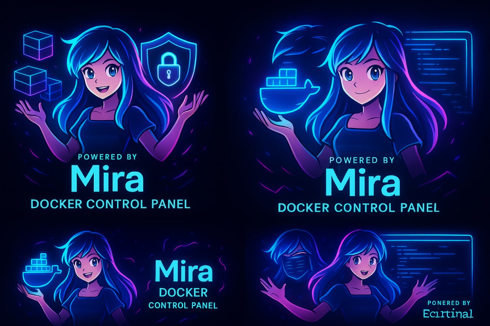
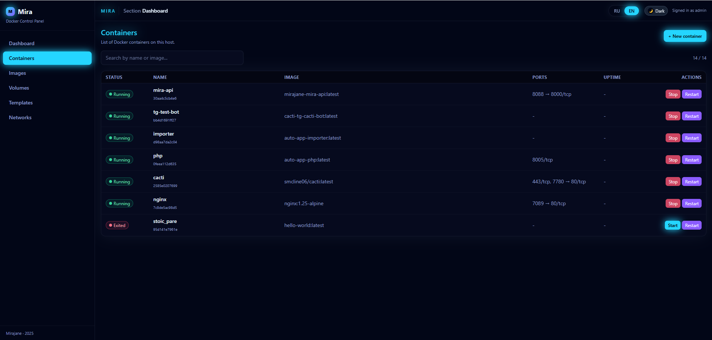
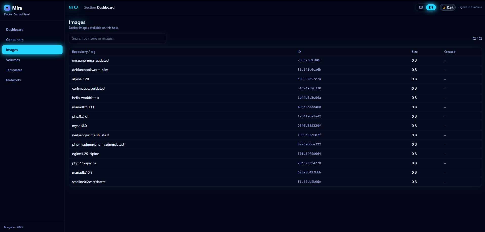
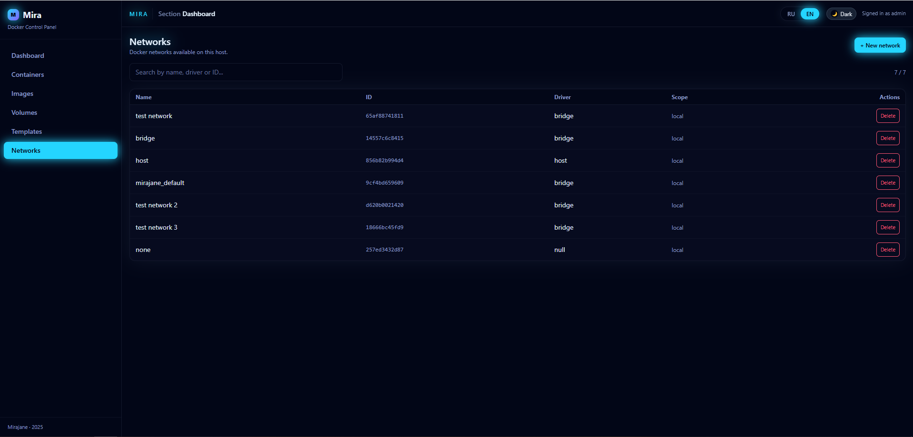
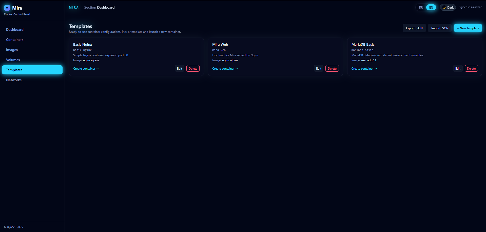

<p align="center">
  
</p>

# 🧩 Mira — Docker Control Panel  
Neon-themed, fast and modern container management UI.

---

# 🇺🇿 O‘zbekcha

## 🚀 Mira haqida
**Mira — bu Docker konteynerlari, tarmoqlar, obrazlar, volumelar va shablonlarni boshqarish uchun zamonaviy veb-panel.**  
Panel React + Vite + Tailwind asosida qurilgan, backend esa FastAPI (Python).

Kuchli tomonlari:
- 🔥 Real vaqtli konteyner monitoringi  
- 🌐 Tarmoqlarni yaratish / o‘chirish  
- 📦 Obrazlar bilan ishlash  
- 🧱 Volume boshqaruvi  
- 📝 Shablonlar orqali tez konteyner yaratish  
- ✨ Neon / cyberpunk UI

---

## 📸 Screenshots

### 🧱 Dashboard / Containers
<p align="center">
  
</p>

### 📦 Images
<p align="center">
  
</p>

### 🌐 Networks
<p align="center">
  
</p>

### 📝 Templates
<p align="center">
  
</p>

## 📦 O‘rnatish

### 1️⃣ Repozitoriyani klonlash
```bash
git clone https://github.com/d3ad0x1/MIRAJANE.git
cd mirajane-mira-panel
```

### 2️⃣.env faylini yaratish

```bash
cp .env.example .env
```

Keyingi parametrlarni to‘ldiring:

```bash
API_URL=http://Sening IP manziling:porting/api/v1
```

### 3️⃣ Docker orqali ishga tushirish

```bash
docker compose up -d --build
```

### 4️⃣ Frontendni ishga tushirish (lokal)

```bash
cd frontend
npm install
npm run dev
```

### 🛠 Kerakli dasturlar

- Docker + Docker Compose
- Node.js 18+
- Git

### 🧯 Muammolarni bartaraf qilish

❗ API ishdan chiqdi yoki 500 xatolik
- Backend konteynerini tekshiring:
```bash
docker compose logs api -f
```

❗ Frontend oq ekran

- Frontend logini ko‘ring:
```bash
npm run dev
```
- API_URL noto‘g‘ri bo‘lishi mumkin.

## 🗂 Loyihaning tuzilishi

- frontend/ — React + Vite asosidagi Mira interfeysi.
Dev rejimida 5173-port orqali ishlaydi, prod rejimida esa nginx orqali xizmat qiladi.
- backend/ — Docker boshqaruvi uchun FastAPI API xizmati.
Asosiy API-servis, konteyner ichidagi port — 8088.
- mira-data/ — Mira uchun doimiy ma’lumotlar katalogi:
shablonlar, presetlar, foydalanuvchi sozlamalari.
Ushbu katalogni muntazam backupga qo‘shish tavsiya etiladi.
- assets/ — bannerlar, logotiplar va UI tasvirlari.
- docker-compose.yml — Mira xizmatlarini orkestratsiya qilish fayli.
- README.md, README_RU.md, README_EN.md — loyiha hujjatlari.

## 🔐 Xavfsizlik

Mira Docker-hostni boshqaradi, demak panelga kirish = serverga to‘liq kirish degani.

Tavsiya etiladi:

- Mirani internetga ochiq holda qo‘ymaslik.
- Foydalanish:
    - VPN (WireGuard / OpenVPN / ZeroTier);
    - ichki tarmoq (LAN);
    - zarurat bo‘lsa SSH tunnel.
- Panelni reverse-proxy orqali ishga tushirish:
    - Nginx / Traefik / Caddy;
    - HTTPS + Basic Auth / tokenlar / SSO.
- /var/run/docker.sock bilan ehtiyotkor bo‘lish:
agar u konteynerga ulangan bo‘lsa, panelga kirgan har qanday foydalanuvchi Dockerga to‘liq root darajasida egalik qiladi.

📄 **License:** [MIT License](LICENSE)